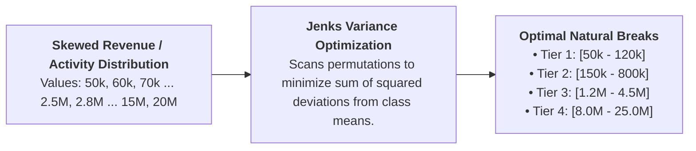
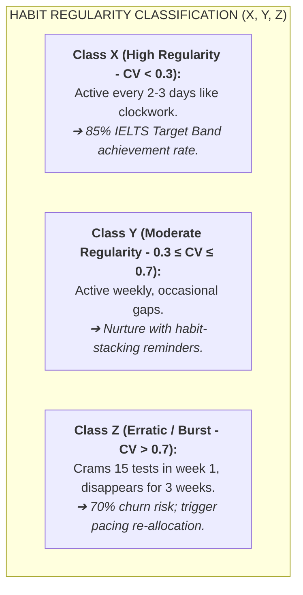
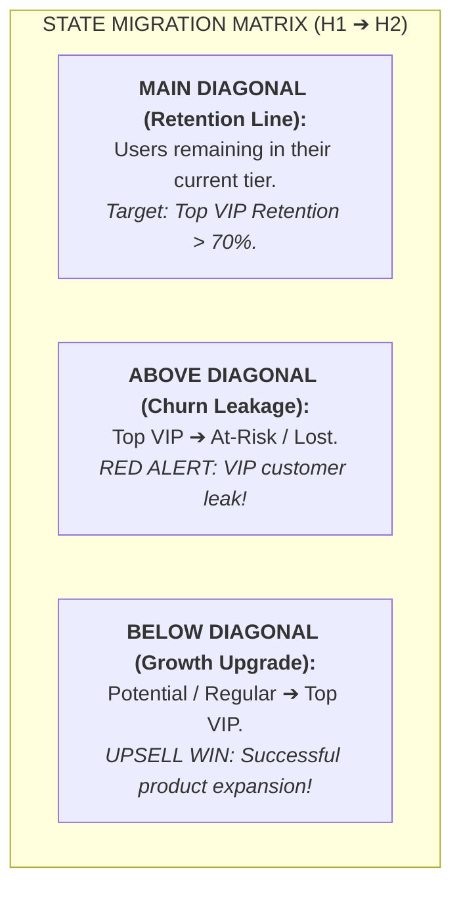
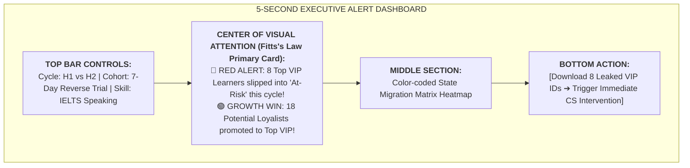

# Advanced RFM/RFE Segmentation, Jenks Natural Breaks & State Migration Analytics

> **This skill exists to stop:** segmenting customers with arbitrary equal-split thresholds — producing non-homogeneous groups and mistargeted campaigns.

> 📁 **Source convention:** `[sage]` = upstream Sage repo (github.com/xoai/sage); `[docs]` = your internal docs repo (optional deep-dives — adjust paths to your setup). Sources are for deeper reading: if a file is missing, the skill still runs on the rules inlined here. The ONLY exception: a step marked **MUST READ** — if that file is missing, STOP and ask the user instead of improvising.

## 🤖 0. HOW TO USE (agent workflow)
**A. Compute RFM/RFE with Jenks natural breaks** — report before/after variance to prove thresholds aren't arbitrary.
**B. H1→H2 migration matrix:** name the most valuable migration flows (who's falling, who's rising) + one action per flow.
**C. 5-second executive dashboard:** one number, one action per tile; every number traceable to its source SQL.
**Standard output:** segment → size → value → action → owner. A segment with no action gets cut from the report.
---

## 🔬 1. Variance Optimization: Jenks Natural Breaks Classification

### The Problem with Equal Split (`NTILE(5)`)

Financial and activity data in EdTech/SaaS follow **power-law (Pareto) distributions**: 5% of users generate 80% of revenue/events. Dividing users into 5 equal 20% bins creates massive distortion by grouping fundamentally different users together.

### The Jenks Algorithm (Wedding Seating Table Metaphor)

The Jenks Natural Breaks algorithm iteratively searches for cut-off thresholds that simultaneously:

1. **Minimize Within-Group Variance ($\text{SDCM} \to \min$):** Users within the same tier are highly homogeneous (e.g. vegetarian guests sit together).
2. **Maximize Between-Group Variance ($\text{SDAM} - \text{SDCM} \to \max$):** Groups are distinctly separated from each other.

$$\text{Goodness of Variance Fit (GVF)} = \frac{\text{SDAM} - \text{SDCM}}{\text{SDAM}} \quad (\text{Target: } GVF \ge 0.85)$$

---

## 🧩 2. Two Decision Dimensions: Profitability ($A, B, C$) & Regularity ($X, Y, Z$)

### Axis 1: Pareto Net Profit (A, B, C)

- **Gross Revenue $\neq$ Net Margin:** A learner paying 5M VND with 50% discount vouchers who spams 200 AI audio tests daily costs more in Token API and server compute than they contribute in profit.
- **Tiers:**
  - **Class A (Top Profit):** Top 20% contributing **80% of net margin**.
  - **Class B (Moderate Profit):** Next tier contributing **15% of margin**.
  - **Class C (Low/Negative Profit):** Contributing **5% of margin** (or net loss).

---

### Axis 2: Habit Regularity (X, Y, Z via CV)

$$\text{Coefficient of Variation (CV)} = \frac{\sigma}{\mu} = \frac{\text{Standard Deviation of Days Between Active Sessions}}{\text{Mean Days Between Active Sessions}}$$

### The $111\text{-Ax}$ vs $111\text{-Cz}$ Acid Test

| Metric               | Learner A (`111-Ax`)                               | Learner B (`111-Cz`)                                 |
| :------------------- | :------------------------------------------------- | :--------------------------------------------------- |
| **Traditional RFM**  | $111$ (High Recency, High Frequency, High Spend)   | $111$ (High Recency, High Frequency, High Spend)     |
| **Net Profit**       | **A** (High-margin subscription, low support cost) | **C** (Heavy promo code, excessive Token API cost)   |
| **Habit Regularity** | **X** ($CV = 0.18$ — steady 3 days/week)           | **Z** ($CV = 0.92$ — crammed 10 tests on 11/11 Sale) |
| **Real Identity**    | **TRUE CORE VIP**                                  | **OPPORTUNISTIC DEAL HUNTER**                        |
| **Action**           | 1:1 VIP mentor care, Beta tester invite.           | Low-cost automated email; no high-touch VIP budget.  |

---

## 🔄 3. Multi-Cycle State Migration Matrix ($H_1 \to H_2$)

To track customer health over time, map user transitions across half-year or quarterly cycles ($H_1 \to H_2$):

---

## ⚡ 4. The 5-Second Executive Dashboard (Fitts's Law)

An executive dashboard must communicate critical anomalies within **3 to 5 seconds**:

---

## 🛠️ 5. Scripts & Templates Included in this Skill

1. [`scripts/jenks_breaks_rfm.py`](scripts/jenks_breaks_rfm.py): Pure Python script to compute 1D Jenks Natural Breaks and calculate $CV$ habit regularity.
2. [`scripts/rfm_migration_matrix.sql`](scripts/rfm_migration_matrix.sql): SQL query to build the $H_1 \to H_2$ transition matrix.
3. [`templates/advanced_rfm_executive_report.md`](templates/advanced_rfm_executive_report.md): Executive Markdown report template.

---

## Appendix — the 11 RFM personas and automatic clustering (from lecture 12)
Score R, F, M on 1–5 and read the combination as a behavioral persona with a default action:
| Persona (typical codes) | Signal | Default action |
|---|---|---|
| Champions (555, 554) | Recent, frequent, high spend | 1:1 care, turn into advocates |
| Loyal (543, 444) | Steady buyers | Upsell / cross-sell, loyalty program |
| Potential loyalists (523, 432) | New-ish, decent spend | Related offers, next-purchase voucher |
| New customers (511, 512) | First purchase | Smooth onboarding, post-purchase care |
| Promising (412, 312) | Recent, no second purchase yet | Re-order nudges |
| Need attention (333, 323) | Decent history, going quiet | Satisfaction check, time-boxed offer |
| About to sleep (222, 212) | Below average, drifting | Re-engagement email, restate value |
| At risk (255, 244) | Spent a lot before, long absence | Urgent rescue campaign |
| Can't lose them (155, 144) | Former champions, gone long | Direct call, privileged offer |
| Hibernating (122, 112) | Long gone, low frequency | Only big-sale pushes, low cost |
| Lost (111) | Lowest on all three | Ignore or cheap automated remarketing |

**Automatic clustering:** normalize R/F/M first (they live on different scales), then K-means: pick K, seed centroids, assign by Euclidean distance, recompute, iterate to convergence. Choose K with the **elbow plot** (WCSS vs K — take the bend, usually K = 3–4) or silhouette score. Too many clusters (K = 50) overfits and no team can run 50 campaigns. Jenks (this skill's main method) and K-means answer different questions: Jenks finds natural thresholds on one dimension; K-means groups on several.
📄 Source: `[docs] guides/v12_guide.md`.
