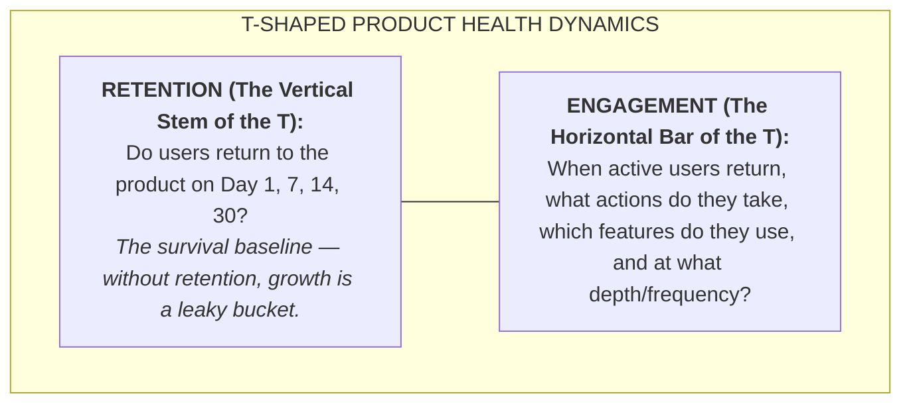
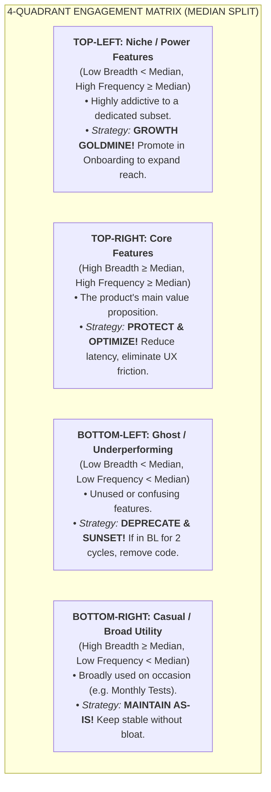
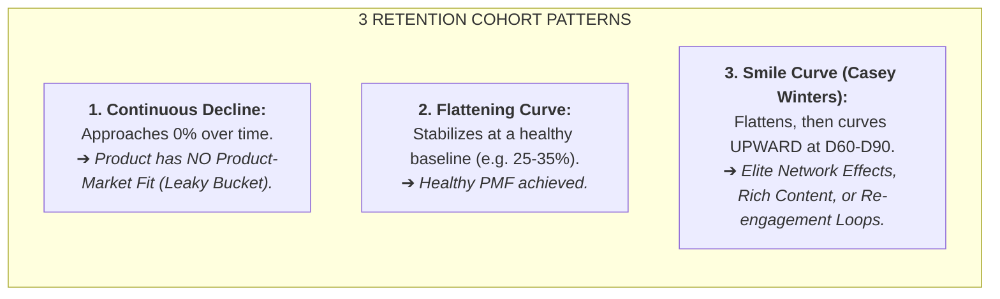

# Amplitude 4-Quadrant Feature Portfolio & Retention Smile Curve Analytics

> **This skill exists to stop:** judging features by gut feel or the loudest voice in the room, instead of their real position on the breadth × frequency matrix.

> 📁 **Source note:** `[sage]` = upstream Sage repo (github.com/xoai/sage, public) — optional deeper reading; this skill runs fully on the rules inlined here. A step marked **MUST READ** points at a file in *your own* project (e.g. an event registry) — if it is missing, stop and ask instead of improvising.

## 🤖 0. HOW TO USE (agent workflow)
**A. Build the 4-quadrant matrix** from MAU/frequency data (median split), with measurement window + source.
**B. Recommend per quadrant:** Core → protect; Power-Niche → scale conditionally; Casual-Broad → raise frequency; dead corner → deletion candidates.
**C. Smile curve:** plot cohorts, mark the inflection; never conclude from incomplete cohorts.
**Standard output:** matrix + one action per feature — no feature parked in "keep watching" indefinitely.
---

## 🧭 1. Core Framework: T-Shaped Retention vs Engagement

- **Rule of Thumb:** Retention is an _outcome_; Engagement with the _right features_ is the _input/lever_.

---

## 📊 2. The 4-Quadrant Engagement Matrix (Median Split)

Every feature in the product portfolio is plotted on a 2D Cartesian plane:

- **X-Axis (Breadth / Reach):** $\%$ of Monthly Active Users (MAU) who used the feature at least once in the 30-day window:
  $$\text{Breadth}(F_i) = \frac{\text{Unique Users using } F_i \text{ in 30d}}{\text{Total MAU in 30d}} \times 100\%$$
- **Y-Axis (Frequency / Depth):** Average number of times an active user of that feature interacted with it in 30 days:
  $$\text{Frequency}(F_i) = \frac{\text{Total Events of } F_i \text{ in 30d}}{\text{Unique Users using } F_i \text{ in 30d}}$$

> [!IMPORTANT]
> **Why Median Split over Mean?** Feature event counts are heavily skewed by power users and automated loops. Using the Arithmetic Mean would artificially push 80% of normal features into the Bottom-Left. Always split axes using **Median Breadth ($\tilde{B}$)** and **Median Frequency ($\tilde{F}$)**.

---

## 📈 3. Retention Cohort Curves & Casey Winters' Smile Curve

When evaluating Cohort Retention curves over 90 days ($D_1 \dots D_{90}$):

### Driving Factors for a Smile Curve in EdTech:

1. **Curriculum Stacking:** Finishing IELTS Foundation $\to$ Starting IELTS Intensive.
2. **Re-take Exam Cycles:** Learners taking the real exam, resting for 2 weeks, then returning for a higher Band score sprint.
3. **Virality & Peer Review:** Learners inviting study partners to review Speaking recordings.

---

## 🎯 4. Step-by-Step Execution Workflow

### Step 1: Feature Event Extraction

Run SQL extraction across all logged product events over the last 30 days (see `scripts/extract_feature_usage.sql`).

### Step 2: Compute Median-Split Coordinates

Calculate Breadth, Frequency, Median X, and Median Y using `scripts/calculate_engagement_matrix.py`.

### Step 3: Classify Portfolio & Build Action Matrix

- **Core (TR):** Benchmark performance (P95 latency, error rates).
- **Power/Niche (TL):** Design a 2-step experiment to introduce this feature during user onboarding.
- **Utility (BR):** Verify reliability and prevent over-engineering.
- **Ghost (BL):** Mark with a 60-day probation window. If still in BL, submit an RFC to remove the feature.

### Step 4: Map Features to Retention Cohorts

Perform correlation analysis: Users who touch $\ge 1$ Niche feature in Week 1 have **$2.4\times$ higher D30 Retention**.

---

## 🛠️ 5. Scripts & Templates Included in this Skill

1. [`scripts/calculate_engagement_matrix.py`](scripts/calculate_engagement_matrix.py): Pure Python script to compute coordinates, medians, quadrant assignments, and generate text-based scatter plots.
2. [`scripts/extract_feature_usage.sql`](scripts/extract_feature_usage.sql): SQL query to extract Breadth and Frequency for every feature event.
3. [`templates/engagement_portfolio_report.md`](templates/engagement_portfolio_report.md): Executive Markdown report template for Product Council reviews.
