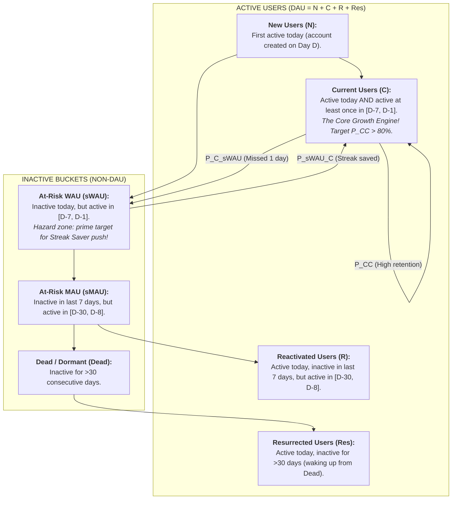
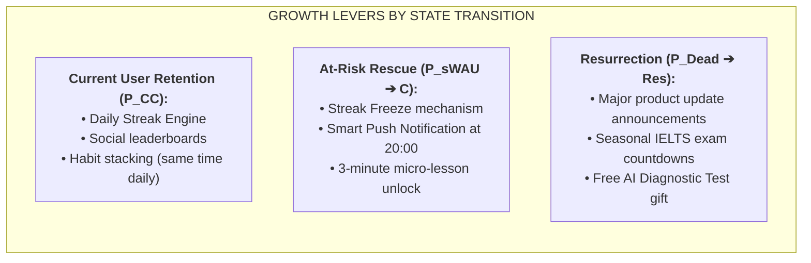

# Duolingo 7-State Markov Growth Modeling & Lifecycle Forecasting

> **This skill exists to stop:** debating retention by gut feel or one blended metric, instead of decomposing users into lifecycle states and finding the exact leaking transition.

> 📁 **Source convention:** `[sage]` = upstream Sage repo (github.com/xoai/sage); `[docs]` = your internal docs repo (optional deep-dives — adjust paths to your setup). Sources are for deeper reading: if a file is missing, the skill still runs on the rules inlined here. The ONLY exception: a step marked **MUST READ** — if that file is missing, STOP and ask the user instead of improvising.

## 🤖 0. HOW TO USE (agent workflow)
**A. Classify users into the 7 lifecycle states** from event data — define the anchor event explicitly and keep it stable; changing it mid-series is a methodology change that must be logged.
**B. Build the transition matrix + DAU forecast:** report data window and source; label forecasts [ASSUMPTION] with a range.
**C. Diagnose:** name the 1–2 transitions most worth improving and the initiative betting on each (hand off to okr-outcome-architect).
**Standard output:** matrix + one bottleneck conclusion + one bet. Never return "retention looks fine" without numbers.
---

## 🧠 1. Core Mathematical Foundation: 7 Lifecycle States

Unlike traditional DAU/MAU ratios that hide churn dynamics, the 7-state model decomposes the entire user base into mutually exclusive, collectively exhaustive buckets:

### State Definitions Matrix

| State Name            | Symbol | Condition on Day $D$                                              | Belongs to DAU? | Strategic Value & Priority                         |
| :-------------------- | :----: | :---------------------------------------------------------------- | :-------------: | :------------------------------------------------- |
| **New Users**         |  $N$   | Active today & Created account today ($D$)                        |     **YES**     | Top of funnel acquisition health                   |
| **Current Users**     |  $C$   | Active today AND active in $[D-7, D-1]$                           |     **YES**     | **P0 Foundation:** Most valuable power users       |
| **Reactivated Users** |  $R$   | Active today, NOT active in $[D-7, D-1]$, active in $[D-30, D-8]$ |     **YES**     | Short-term win-back efficiency                     |
| **Resurrected Users** | $Res$  | Active today, NOT active in last 30 days                          |     **YES**     | Long-term brand recall / Re-engagement             |
| **At-Risk WAU**       | $sWAU$ | NOT active today, but active in $[D-7, D-1]$                      |       NO        | **Highest Leverage:** Prevent slipping into $sMAU$ |
| **At-Risk MAU**       | $sMAU$ | NOT active in last 7 days, active in $[D-30, D-8]$                |       NO        | Churn warning zone                                 |
| **Dead Users**        | $Dead$ | Inactive for $>30$ consecutive days                               |       NO        | Churned cohort; low ROI for high-touch ops         |

$$\text{DAU}(D) = N(D) + C(D) + R(D) + Res(D)$$
$$\text{WAU}(D) = \text{DAU}(D) + sWAU(D)$$
$$\text{MAU}(D) = \text{WAU}(D) + sMAU(D)$$

---

## 📊 2. Transition Probability Matrix ($P$) & Forecasting

The state of the system evolves daily through the $7 \times 7$ Transition Matrix $\mathbf{P}$:

$$\mathbf{S}_{D} = \begin{bmatrix} N_D & C_D & R_D & Res_D & sWAU_D & sMAU_D & Dead_D \end{bmatrix}$$

$$
\mathbf{P} = \begin{bmatrix}
0 & P_{N \to C} & 0 & 0 & P_{N \to sWAU} & 0 & 0 \\
0 & P_{C \to C} & 0 & 0 & P_{C \to sWAU} & 0 & 0 \\
0 & P_{R \to C} & 0 & 0 & P_{R \to sWAU} & 0 & 0 \\
0 & P_{Res \to C} & 0 & 0 & P_{Res \to sWAU} & 0 & 0 \\
0 & P_{sWAU \to C} & 0 & 0 & P_{sWAU \to sWAU} & P_{sWAU \to sMAU} & 0 \\
0 & 0 & P_{sMAU \to R} & 0 & 0 & P_{sMAU \to sMAU} & P_{sMAU \to Dead} \\
0 & 0 & 0 & P_{Dead \to Res} & 0 & 0 & P_{Dead \to Dead}
\end{bmatrix}
$$

### Forecasting Engine

To forecast $k$ days into the future:

1. Forecast New Users $N(D+1 \dots D+k)$ using Time Series models (e.g. Meta Prophet / ARIMA).
2. Propagate existing users through the Markov Chain: $\mathbf{S}_{D+k} = \mathbf{S}_D \times \mathbf{P}^k$.
3. Sum up active states to obtain projected DAU, WAU, and MAU.

---

## 🎯 3. Step-by-Step Diagnostic & Growth Playbook

When analyzing an EdTech / SaaS product using this skill, execute the following 5 steps:

### Step 1: Data Extraction

Run SQL extraction to compute the daily state for every user over the last 60–90 days (see `scripts/extract_states.sql`).

### Step 2: Compute Empirical Transition Matrix

Calculate transition probabilities by aggregating pairs of $(S_{D-1}, S_D)$ across the selected period.

### Step 3: Run Sensitivity / Manchester United Analysis

- **The Analogy:** A football club does not win championships by buying 50 new players every week ($N$). It wins by keeping its star players fit and playing on the pitch every match ($C \to C$).
- **Sensitivity Check:** Test a 1% increase in $P_{C \to C}$ vs a 10% increase in $N$. In 95% of subscription products, improving $P_{C \to C}$ by 1% produces **3x to 5x more long-term DAU** than doubling top-of-funnel ad spend.

### Step 4: Isolate Churn Leakage Points

- If $P_{C \to sWAU} > 25\%$: The onboarding or daily learning habit loop is breaking.
- If $P_{sWAU \to C} < 30\%$: Notifications, Streak Freeze, and re-engagement triggers are ineffective.
- If $P_{sMAU \to Dead} > 80\%$: Once a user leaves for 2 weeks, they are permanently lost.

### Step 5: Prescribe Growth Levers

---

## 🛠️ 4. Scripts & Templates Included in this Skill

1. [`scripts/calculate_markov.py`](scripts/calculate_markov.py): Standalone Python script to compute transition matrices and forecast DAU up to 90 days.
2. [`scripts/extract_states.sql`](scripts/extract_states.sql): Production SQL query to label daily user states.
3. [`templates/markov_growth_report.md`](templates/markov_growth_report.md): Markdown template for executive growth reporting.
