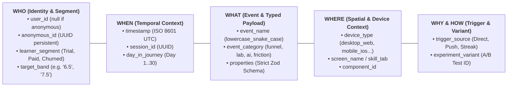
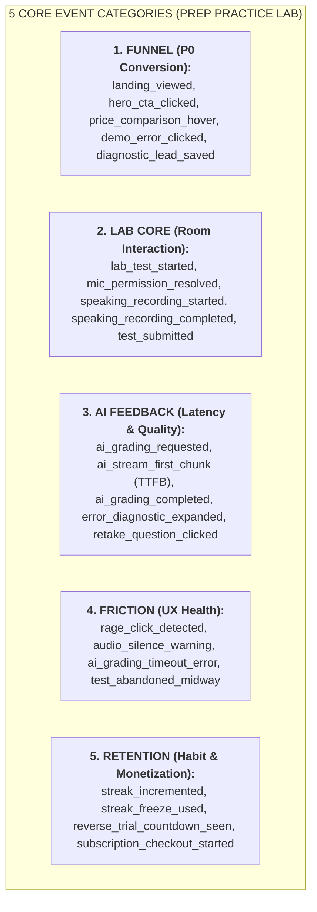

# công ty Tracking Architect: 5W1H Type-Safe Event Taxonomy & Data Contracts

> **This skill exists to stop:** designing new events without checking the existing contract — spawning a third naming convention and fragmenting data (a failure that actually happened; see rationalization T5).

> 📁 **Source convention:** `[sage]` = upstream Sage repo (github.com/xoai/sage); `[docs]` = your internal docs repo (optional deep-dives — adjust paths to your setup). Sources are for deeper reading: if a file is missing, the skill still runs on the rules inlined here. The ONLY exception: a step marked **MUST READ** — if that file is missing, STOP and ask the user instead of improvising.

## 🤖 0. HOW TO USE (agent workflow)
**A. Add a new event:** MUST READ the event registry + tracking contract first — extend the existing taxonomy, never invent a new naming scheme. Every event carries 5W1H + `schema_version`.
**B. Audit tracking:** reconcile emitted events against the registry; report status against the runtime verification gates ("spec'd" ≠ "verified"). Output: item → status → missing gate.
**C. Funnel SQL:** production only; exclude QA/bot traffic and unsupported schema versions.
**MUST:** every tracking claim declares its verification status; an absent metric is absent, never zero.
---

## 🏛️ 1. Core Architecture: The 5W1H Universal Data Contract

Every analytics event emitted from Web, Mobile, or Backend **MUST** adhere to the strict 5W1H structural contract:



### Golden Engineering Invariants

1. **Zero Untyped Logs:** No arbitrary `track('click', { foo: 'bar' })`. Every event must have an explicit TypeScript Zod schema.
2. **Server Verification for Macro-Conversions:** `purchase_completed` and `test_submitted` must be emitted or verified server-side. Client never directly declares a purchase complete.
3. **No PII in Tracking Payloads:** Raw passwords, plain credit cards, or unhashed personal phone numbers are strictly prohibited. Use SHA-256 for user identifiers when needed.

---

## 📋 2. Full Event Taxonomy Matrix (5 Core Categories)



---

## 🛠️ 3. Type-Safe Client Helper Implementation Pattern

```typescript
import { z } from "zod";
import { BaseEventSchema, EventSchemas } from "./tracking-schema";

export function trackEvent<K extends keyof typeof EventSchemas>(
  eventName: K,
  payload: z.infer<(typeof EventSchemas)[K]>,
) {
  const validation = EventSchemas[eventName].safeParse(payload);
  if (!validation.success) {
    console.error(
      `[Tracking Validation Error] Event '${eventName}' invalid:`,
      validation.error.format(),
    );
    if (process.env.NODE_ENV === "development") {
      throw new Error(`Invalid tracking payload for ${eventName}`);
    }
    return;
  }

  // Dispatch validated event to Analytics Pipeline (Segment / Mixpanel / Internal DB)
  window.analytics?.track(eventName, validation.data);
}
```

---

## 📊 4. Standard Funnel Conversion SQL (`funnel_dropoff_analysis.sql`)

Calculates step-by-step conversion and identifies the biggest drop-off choke points:

$$\text{Step Conversion Rate} = \frac{\text{Users completing Step } N}{\text{Users completing Step } N-1} \times 100\%$$

---

## 🛠️ 5. Scripts & Templates Included in this Skill

1. [`templates/tracking-schema.ts`](file:///Users/admin/workspaces/prep-fe/practice-labs/.claude/skills/tracking-architect/templates/tracking-schema.ts): Production TypeScript Zod Schemas for all 5 event categories.
2. [`scripts/funnel_dropoff_analysis.sql`](file:///Users/admin/workspaces/prep-fe/practice-labs/.claude/skills/tracking-architect/scripts/funnel_dropoff_analysis.sql): SQL query to compute step-by-step conversion and drop-off rates.
3. [`templates/tracking_audit_checklist.md`](file:///Users/admin/workspaces/prep-fe/practice-labs/.claude/skills/tracking-architect/templates/tracking_audit_checklist.md): Pre-release tracking QA checklist.
