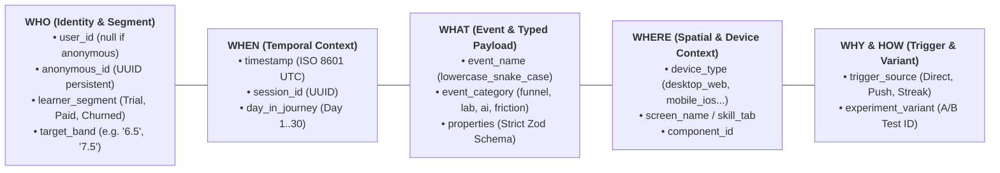
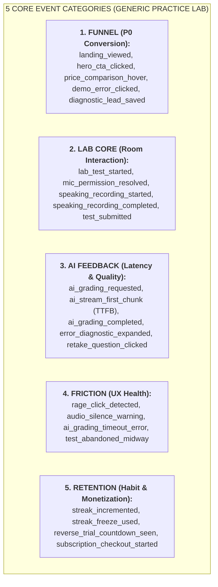

# Tracking Architect: 5W1H Type-Safe Event Taxonomy & Data Contracts

> **This skill exists to stop:** designing new events without checking the existing contract — spawning a third naming convention and fragmenting data (a failure that actually happened; see rationalization T5).

> 📁 **Source note:** `[sage]` = upstream Sage repo (github.com/xoai/sage, public) — optional deeper reading; this skill runs fully on the rules inlined here. A step marked **MUST READ** points at a file in *your own* project (e.g. an event registry) — if it is missing, stop and ask instead of improvising.

## 🤖 0. HOW TO USE (agent workflow)
**A. Add a new event:** MUST READ the event registry + tracking contract first — extend the existing taxonomy, never invent a new naming scheme. Map the 5W1H semantics and versioning policy to that contract; preserve existing field names, optionality, identity rules, and supported schema versions. If the required registry is missing, ask for it before finalizing an extension; a labeled proposal can still identify the gap.
**B. Audit tracking:** reconcile emitted events against the registry; report status against the runtime verification gates ("spec'd" ≠ "verified"). Output: item → status → missing gate.
**C. Funnel SQL:** use production evidence for production claims; exclude QA/bot traffic and unsupported schema versions. Synthetic examples may demonstrate a query but must be labeled and cannot verify a live funnel.
**MUST:** every tracking claim declares its verification status; an absent metric is absent, never zero.
---

## 🏛️ 1. Core Architecture: Mapping 5W1H to the Existing Contract

Use 5W1H to check which context each event needs, not to impose a universal envelope. The diagram is an edtech TypeScript/Zod example; adapt its fields, naming, and validation to the target registry and stack. Record intentional omissions and version compatibility.


```mermaid
graph LR
    WHO["<b>WHO (Identity & Segment)</b><br/>• user_id (null if anonymous)<br/>• anonymous_id (UUID persistent)<br/>• learner_segment (Trial, Paid, Churned)<br/>• target_band (e.g. '6.5', '7.5')"]
    WHEN["<b>WHEN (Temporal Context)</b><br/>• timestamp (ISO 8601 UTC)<br/>• session_id (UUID)<br/>• day_in_journey (Day 1..30)"]
    WHAT["<b>WHAT (Event & Typed Payload)</b><br/>• event_name (lowercase_snake_case)<br/>• event_category (funnel, lab, ai, friction)<br/>• properties (Strict Zod Schema)"]
    WHERE["<b>WHERE (Spatial & Device Context)</b><br/>• device_type (desktop_web, mobile_ios...)<br/>• screen_name / skill_tab<br/>• component_id"]
    WHY["<b>WHY & HOW (Trigger & Variant)</b><br/>• trigger_source (Direct, Push, Streak)<br/>• experiment_variant (A/B Test ID)"]

    WHO --- WHEN --- WHAT --- WHERE --- WHY
```

### Golden Engineering Invariants

1. **Validated Contracts:** Every event must conform to the target registry’s schema and validation mechanism (for example Protobuf, JSON Schema, or Zod). Extend existing contracts instead of adding a parallel schema system.
2. **Server Verification for Macro-Conversions:** `purchase_completed` and `test_submitted` must be emitted or verified server-side. Client never directly declares a purchase complete.
3. **No PII in Tracking Payloads:** Raw passwords, plain credit cards, or unhashed personal phone numbers are strictly prohibited. Use the project’s approved pseudonymous identity policy; hashing a direct identifier does not automatically make it anonymous.

---

## 📋 2. Full Event Taxonomy Matrix (5 Core Categories)


```mermaid
graph TD
    subgraph TAXONOMY["5 CORE EVENT CATEGORIES (GENERIC PRACTICE LAB)"]
        C1["<b>1. FUNNEL (P0 Conversion):</b><br/>landing_viewed, hero_cta_clicked, price_comparison_hover, demo_error_clicked, diagnostic_lead_saved"]
        C2["<b>2. LAB CORE (Room Interaction):</b><br/>lab_test_started, mic_permission_resolved, speaking_recording_started, speaking_recording_completed, test_submitted"]
        C3["<b>3. AI FEEDBACK (Latency & Quality):</b><br/>ai_grading_requested, ai_stream_first_chunk (TTFB), ai_grading_completed, error_diagnostic_expanded, retake_question_clicked"]
        C4["<b>4. FRICTION (UX Health):</b><br/>rage_click_detected, audio_silence_warning, ai_grading_timeout_error, test_abandoned_midway"]
        C5["<b>5. RETENTION (Habit & Monetization):</b><br/>streak_incremented, streak_freeze_used, reverse_trial_countdown_seen, subscription_checkout_started"]
    end
```

---

## 🛠️ 3. Type-Safe Client Helper Implementation Pattern

Illustrative TypeScript/Zod adapter. Use this only where it matches the existing stack; schema validation alone does not prove an event was emitted, received, stored, or correctly reported.

```typescript
import { z } from "zod";
import { BaseEventSchema, EventSchemas } from "./tracking-schema";

export function trackEvent<K extends keyof typeof EventSchemas>(
  eventName: K,
  payload: z.infer<(typeof EventSchemas)[K]>,
) {
  const validation = EventSchemas[eventName].safeParse(payload);
  if (!validation.success) {
    console.error(
      `[Tracking Validation Error] Event '${eventName}' invalid:`,
      validation.error.format(),
    );
    if (process.env.NODE_ENV === "development") {
      throw new Error(`Invalid tracking payload for ${eventName}`);
    }
    return;
  }

  // Dispatch validated event to Analytics Pipeline (Segment / Mixpanel / Internal DB)
  window.analytics?.track(eventName, validation.data);
}
```

---

## 📊 4. Standard Funnel Conversion SQL (`funnel_dropoff_analysis.sql`)

Adapt the bundled SQL to the target dialect, identity model, event ordering, production/QA filters, version policy, and observation window. Its sample final event is checkout start, not verified payment; define the actual conversion event from the registry before using it for revenue claims. Validate instrumentation coverage before interpreting missing events as non-conversions.

Calculates step-by-step conversion:

$$\text{Step Conversion Rate} = \frac{\text{Users completing Step } N}{\text{Users completing Step } N-1} \times 100\%$$

---

## 🛠️ 5. Scripts & Templates Included in this Skill

1. [`templates/tracking-schema.ts`](templates/tracking-schema.ts): Illustrative TypeScript/Zod schemas across 5 event categories; extend the target registry instead of copying wholesale.
2. [`scripts/funnel_dropoff_analysis.sql`](scripts/funnel_dropoff_analysis.sql): SQL query to compute step-by-step conversion and drop-off rates.
3. [`templates/tracking_audit_checklist.md`](templates/tracking_audit_checklist.md): Pre-release tracking QA checklist.
